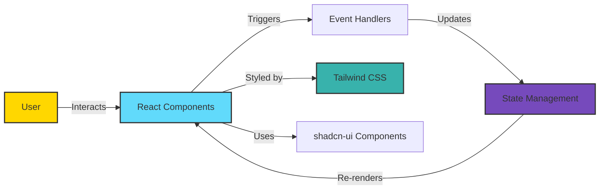
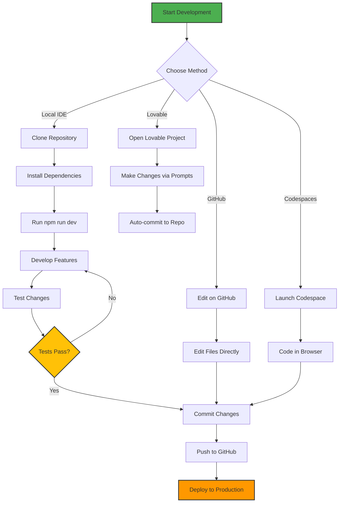
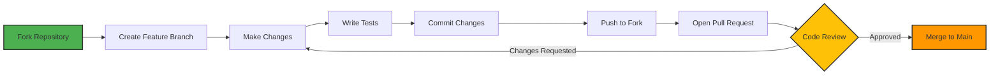

# 🚀 CodeKick

<div align="center">


[](https://www.typescriptlang.org/)
[](https://reactjs.org/)
[](https://vitejs.dev/)
[](https://tailwindcss.com/)

**A modern, fast, and elegant web application built with cutting-edge technologies**

[Live Demo](https://lovable.dev/projects/54c3655a-5c55-4b5f-9a8d-ee513fcca631) • [Report Bug](https://github.com/Failureguy94/codekick/issues) • [Request Feature](https://github.com/Failureguy94/codekick/issues)

</div>

---

## 📋 Table of Contents

- [Overview](#-overview)
- [Architecture](#-architecture)
- [Features](#-features)
- [Tech Stack](#-tech-stack)
- [Getting Started](#-getting-started)
- [Development Workflow](#-development-workflow)
- [Project Structure](#-project-structure)
- [Deployment](#-deployment)
- [Contributing](#-contributing)
- [License](#-license)

---

## 🎯 Overview

**CodeKick** is a modern web application that leverages the power of React 18, TypeScript, and Vite to deliver a blazing-fast user experience. Built with developer experience in mind, it utilizes shadcn-ui components and Tailwind CSS for a beautiful, responsive interface.

### Key Highlights

- ⚡ **Lightning Fast** - Powered by Vite for instant HMR and optimized builds
- 🎨 **Beautiful UI** - Crafted with shadcn-ui and Tailwind CSS
- 🔒 **Type Safe** - Full TypeScript support for robust code
- 📱 **Responsive** - Mobile-first design approach
- 🛠️ **Developer Friendly** - Hot reload, modern tooling, and great DX

---

## 🏗️ Architecture

### System Architecture

```mermaid
graph TB
    subgraph "Frontend Layer"
        A[React Application]
        B[TypeScript]
        C[Vite Dev Server]
    end
    
    subgraph "UI Components"
        D[shadcn-ui]
        E[Tailwind CSS]
        F[Custom Components]
    end
    
    subgraph "Build & Deploy"
        G[Vite Build]
        H[Lovable Platform]
        I[Production Build]
    end
    
    A --> B
    A --> D
    D --> E
    D --> F
    C --> A
    A --> G
    G --> H
    H --> I
    
    style A fill:#61DAFB,stroke:#333,stroke-width:2px
    style D fill:#000000,stroke:#333,stroke-width:2px
    style E fill:#38B2AC,stroke:#333,stroke-width:2px
    style G fill:#646CFF,stroke:#333,stroke-width:2px
```



### Application Flow



### Component Hierarchy

```mermaid
graph TD
    A[App Root] --> B[Layout Components]
    A --> C[Page Components]
    B --> D[Header]
    B --> E[Footer]
    B --> F[Sidebar]
    C --> G[Home Page]
    C --> H[Feature Pages]
    G --> I[shadcn-ui Components]
    H --> I
    I --> J[Button]
    I --> K[Card]
    I --> L[Dialog]
    I --> M[Form Elements]
    
    style A fill:#FF6B6B,stroke:#333,stroke-width:3px
    style B fill:#4ECDC4,stroke:#333,stroke-width:2px
    style C fill:#45B7D1,stroke:#333,stroke-width:2px
    style I fill:#000000,stroke:#fff,stroke-width:2px
```



---

## ✨ Features

- 🎨 **Modern UI/UX** - Clean, intuitive interface built with shadcn-ui
- 🚀 **Fast Performance** - Optimized with Vite's lightning-fast build tool
- 📱 **Fully Responsive** - Seamless experience across all devices
- 🔧 **Type Safety** - Built with TypeScript for fewer runtime errors
- 🎯 **Component Library** - Reusable components following best practices
- 🌙 **Dark Mode Ready** - Support for light and dark themes
- ♿ **Accessible** - WCAG compliant components
- 🔄 **Hot Module Replacement** - Instant feedback during development

---

## 🛠️ Tech Stack

### Core Technologies

| Technology | Version | Purpose |
|------------|---------|---------|
| **React** | 18.x | UI Library |
| **TypeScript** | 5.x | Type Safety |
| **Vite** | 5.x | Build Tool & Dev Server |
| **Tailwind CSS** | 3.x | Styling Framework |
| **shadcn-ui** | Latest | Component Library |

### Development Tools

- **Node.js** - Runtime environment
- **npm** - Package manager
- **ESLint** - Code linting
- **Prettier** - Code formatting
- **Git** - Version control

---

## 🚀 Getting Started

### Prerequisites

Before you begin, ensure you have the following installed:

- **Node.js** (v18 or higher) - [Download & Install](https://nodejs.org/)
- **npm** (comes with Node.js) or **yarn**
- **Git** - [Download & Install](https://git-scm.com/)

### Installation

1. **Clone the repository**

```bash
git clone https://github.com/Failureguy94/codekick.git
cd codekick
```

2. **Install dependencies**

```bash
npm install
```

3. **Start the development server**

```bash
npm run dev
```

4. **Open your browser**

Navigate to `http://localhost:5173` to see your application running.

### Quick Start with Different Methods

#### Method 1: Using Lovable (Recommended)

Simply visit the [Lovable Project](https://lovable.dev/projects/54c3655a-5c55-4b5f-9a8d-ee513fcca631) and start prompting. Changes made via Lovable will be committed automatically to this repo.

#### Method 2: GitHub Codespaces

1. Navigate to the main page of the repository
2. Click on the "Code" button (green button)
3. Select the "Codespaces" tab
4. Click on "New codespace"
5. Edit files directly and commit your changes

#### Method 3: Local Development with IDE

```bash
# Clone the repository
git clone https://github.com/Failureguy94/codekick.git

# Navigate to the project directory
cd codekick

# Install dependencies
npm install

# Start development server
npm run dev
```

---

## 🔄 Development Workflow

### Available Scripts

| Command | Description |
|---------|-------------|
| `npm run dev` | Start development server with hot reload |
| `npm run build` | Build for production |
| `npm run preview` | Preview production build locally |
| `npm run lint` | Run ESLint to check code quality |

### Development Process Flow



---

## 📁 Project Structure

```
codekick/
├── 📂 src/
│   ├── 📂 components/       # React components
│   │   ├── 📂 ui/          # shadcn-ui components
│   │   └── 📄 ...          # Custom components
│   ├── 📂 lib/             # Utility functions
│   ├── 📂 hooks/           # Custom React hooks
│   ├── 📂 pages/           # Page components
│   ├── 📂 styles/          # Global styles
│   ├── 📄 App.tsx          # Root component
│   ├── 📄 main.tsx         # Entry point
│   └── 📄 vite-env.d.ts    # Vite type definitions
├── 📂 public/              # Static assets
├── 📄 index.html           # HTML entry point
├── 📄 package.json         # Project dependencies
├── 📄 tsconfig.json        # TypeScript configuration
├── 📄 vite.config.ts       # Vite configuration
├── 📄 tailwind.config.js   # Tailwind configuration
├── 📄 components.json      # shadcn-ui configuration
└── 📄 README.md            # This file
```

### Component Organization

```mermaid
graph LR
    A[src/] --> B[components/]
    A --> C[pages/]
    A --> D[lib/]
    A --> E[hooks/]
    
    B --> F[ui/]
    B --> G[layout/]
    B --> H[features/]
    
    F --> I[shadcn-ui Components]
    G --> J[Header, Footer, etc.]
    H --> K[Feature-specific Components]
    
    style A fill:#61DAFB,stroke:#333,stroke-width:2px
    style B fill:#4ECDC4,stroke:#333,stroke-width:2px
    style F fill:#000000,stroke:#fff,stroke-width:2px
```



---

## 🌐 Deployment

### Deploy to Production

1. **Via Lovable Platform**

   Simply open [Lovable](https://lovable.dev/projects/54c3655a-5c55-4b5f-9a8d-ee513fcca631) and click on **Share → Publish**.

2. **Manual Build**

```bash
# Build the project
npm run build

# Preview the build locally
npm run preview
```

The built files will be in the `dist/` directory, ready to be deployed to any static hosting service.

### Custom Domain Setup

To connect a custom domain:

1. Navigate to **Project > Settings > Domains**
2. Click **Connect Domain**
3. Follow the instructions

📚 [Learn more about custom domains](https://docs.lovable.dev/features/custom-domain#custom-domain)

---

## 🤝 Contributing

We welcome contributions from the community! Here's how you can help:

### Contribution Workflow



### Steps to Contribute

1. **Fork the repository**
2. **Create a feature branch**
   ```bash
   git checkout -b feature/amazing-feature
   ```
3. **Make your changes**
4. **Commit your changes**
   ```bash
   git commit -m 'Add some amazing feature'
   ```
5. **Push to the branch**
   ```bash
   git push origin feature/amazing-feature
   ```
6. **Open a Pull Request**

### Coding Standards

- Follow TypeScript best practices
- Use ESLint and Prettier for code formatting
- Write meaningful commit messages
- Add comments for complex logic
- Ensure all tests pass before submitting PR

---

## 📄 License

This project is licensed under the **MIT License** - see the [LICENSE](LICENSE) file for details.

---

## 🙏 Acknowledgments

- [React](https://reactjs.org/) - The library for web and native user interfaces
- [Vite](https://vitejs.dev/) - Next generation frontend tooling
- [shadcn-ui](https://ui.shadcn.com/) - Beautifully designed components
- [Tailwind CSS](https://tailwindcss.com/) - A utility-first CSS framework
- [Lovable](https://lovable.dev/) - AI-powered development platform

---

## 📞 Contact & Support

- **GitHub Issues**: [Report a bug](https://github.com/Failureguy94/codekick/issues)
- **Feature Requests**: [Request a feature](https://github.com/Failureguy94/codekick/issues)
- **Discussions**: [Join the conversation](https://github.com/Failureguy94/codekick/discussions)

---

<div align="center">

**Made with ❤️ by [Failureguy94](https://github.com/Failureguy94)**

⭐ Star this repository if you find it helpful!

</div>
