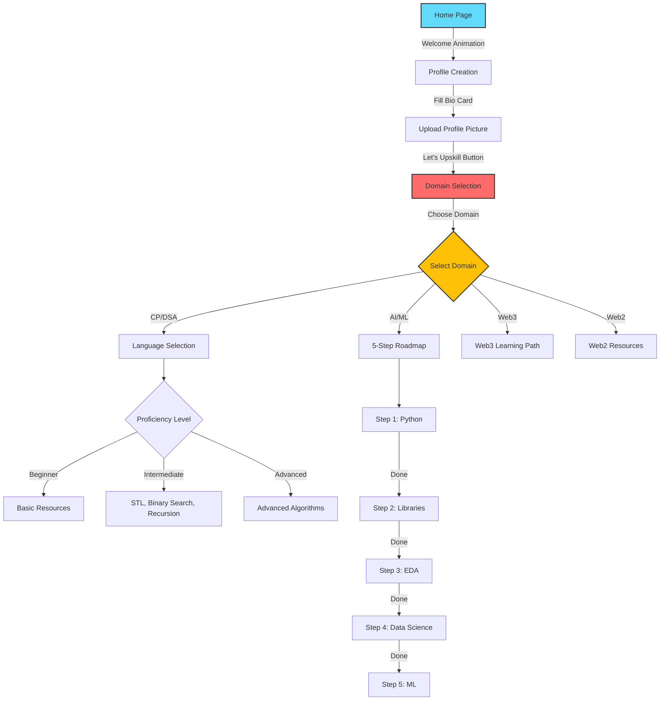
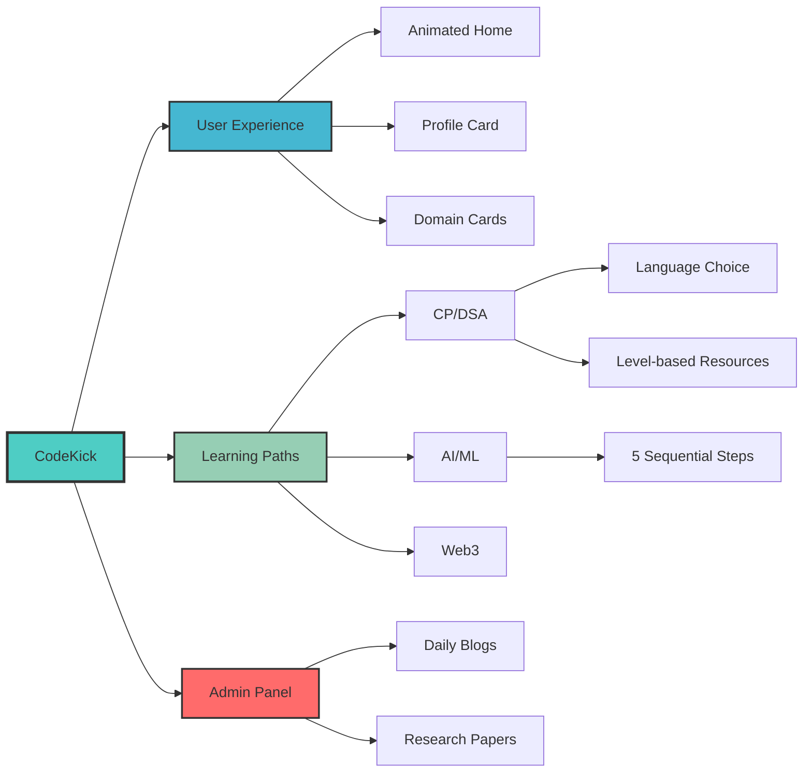

# 🚀 CodeKick

<div align="center">


[](https://reactjs.org/)
[](https://www.typescriptlang.org/)
[](https://vitejs.dev/)
[](https://www.framer.com/motion/)

**Helping college freshers navigate their tech journey with personalized learning paths**

[Live Demo](https://lovable.dev/projects/54c3655a-5c55-4b5f-9a8d-ee513fcca631) • [Report Bug](https://github.com/Failureguy94/codekick/issues) • [Request Feature](https://github.com/Failureguy94/codekick/issues)

</div>

---

## 💡 What is CodeKick?

CodeKick is an interactive platform designed specifically for college freshers who are confused about which tech domain to pursue. Instead of overwhelming you with information, we guide you step-by-step through discovering your path in:

- 💻 **Competitive Programming & DSA**
- 🤖 **Artificial Intelligence & Machine Learning**
- 🌐 **Web3 Development**
- 🎨 **Web2 Development**

## ✨ Key Features

### 🎯 Dynamic Welcome Experience
An engaging animated homepage with floating symbols of programming languages (C++, Python) and tech domains (AI/ML, Web3, CP/DSA) that immediately immerse you in the tech world.

### 👤 Personalized Profile Card
Create your tech identity with:
- Coding platform handles (LeetCode, Codeforces, etc.)
- Social links (LinkedIn, Telegram for Web3 communities)
- Personal bio section
- **Flip card interaction** - Save your info and upload a profile picture on the flip side

### 🗺️ Interactive Domain Selection
Hover over domain cards to reveal:
- What the domain is about
- Advantages and disadvantages
- Potential salary insights
- Time to mastery estimates

### 📚 Personalized Learning Paths

#### CP/DSA Track
- Choose your language: **Java**, **C++**, or **Python**
- Select proficiency level: Beginner, Intermediate, or Advanced
- Get curated resources based on your level:
  - **Beginner**: YouTube tutorials and foundational concepts
  - **Intermediate**: STL, Binary Search, Prefix Sums, Recursion & Backtracking
  - **Advanced**: Bit Manipulation, Graph Algorithms (BFS/DFS), Sieve
- Progressive resource unlocking - complete one topic to unlock the next

#### AI/ML Track (5-Step Roadmap)
Sequential learning path with "Done" buttons:
1. **Python Fundamentals**
2. **Data Science Libraries** (NumPy, Pandas, Matplotlib, Seaborn)
3. **Exploratory Data Analysis (EDA)**
4. **Data Science Concepts**
5. **Machine Learning Fundamentals**

#### Web3 Track
Structured progression:
1. React fundamentals
2. Web3 development basics
3. Advanced Web3 concepts

### 📰 Admin Features
- **Daily CP Blogs**: Platform tutorials, competitive programming news
- **Research Papers Section**: Daily AI/ML research paper updates
- Password-protected admin panel for content updates

---

## 🛠️ Tech Stack

| Technology | Purpose |
|------------|---------|
| **React 18** | Component-based UI |
| **TypeScript** | Type-safe code |
| **Vite** | Fast development & builds |
| **Framer Motion** | Smooth animations |
| **Lucide React** | Beautiful icons |
| **Tailwind CSS** | Utility-first styling |

---

## 🚀 Getting Started

### Prerequisites
- Node.js (v18+)
- npm or yarn

### Installation

```bash
# Clone the repository
git clone https://github.com/Failureguy94/codekick.git

# Navigate to directory
cd codekick

# Install dependencies
npm install

# Start development server
npm run dev
```

Visit `http://localhost:5173` to see the app running!

---

## 🎨 Project Architecture

### Application Flow



### Feature Breakdown



---

## 📂 Project Structure

```
codekick/
├── src/
│   ├── components/
│   │   ├── Home/              # Welcome animation
│   │   ├── Profile/           # Bio card & flip card
│   │   ├── DomainSelection/   # Domain cards
│   │   ├── CP/                # CP/DSA learning paths
│   │   ├── AIML/              # 5-step ML roadmap
│   │   ├── Web3/              # Web3 resources
│   │   └── Admin/             # Admin dashboard
│   ├── pages/
│   ├── hooks/
│   ├── utils/
│   └── App.tsx
├── public/
├── package.json
└── vite.config.ts
```

---

## 🎯 How It Works

### For Students

1. **Start**: Experience the animated welcome screen
2. **Create Profile**: Fill in your coding handles and social links
3. **Choose Domain**: Explore domains with interactive hover effects
4. **Select Track**: Pick your language (for CP) or follow step-by-step path (for AI/ML)
5. **Learn**: Access curated resources based on your level
6. **Progress**: Unlock next resources as you complete previous ones

### For Admins

Access the admin panel to:
- Update daily CP news and tutorials
- Share latest AI/ML research papers
- Keep content fresh and relevant

---

## 🌟 What Makes CodeKick Different?

- **No Information Overload**: Progressive disclosure of resources
- **Interactive Design**: Engaging animations and flip cards
- **Personalized Journey**: Tailored paths based on your choices
- **Curated Content**: Hand-picked resources for each level
- **Clear Progression**: Visual tracking of your learning journey

---

## 🤝 Contributing

We welcome contributions! Here's how:

1. Fork the repository
2. Create your feature branch (`git checkout -b feature/AmazingFeature`)
3. Commit changes (`git commit -m 'Add AmazingFeature'`)
4. Push to branch (`git push origin feature/AmazingFeature`)
5. Open a Pull Request

---

## 📄 License

This project is licensed under the MIT License.

---

## 🙏 Acknowledgments

Special thanks to all the educators and content creators whose resources make this platform possible.

---

<div align="center">

**Built with ❤️ for college freshers navigating their tech journey**

Made by [Failureguy94](https://github.com/Failureguy94)

⭐ Star this repo if it helps you!

</div>